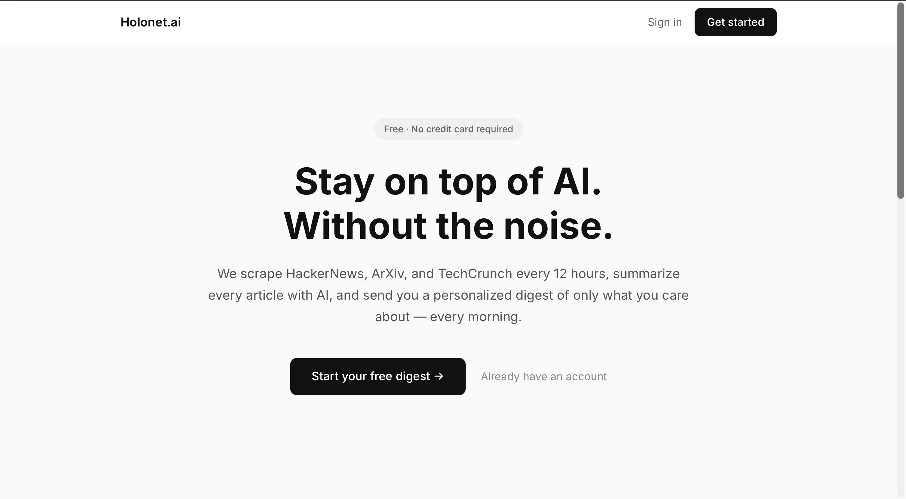
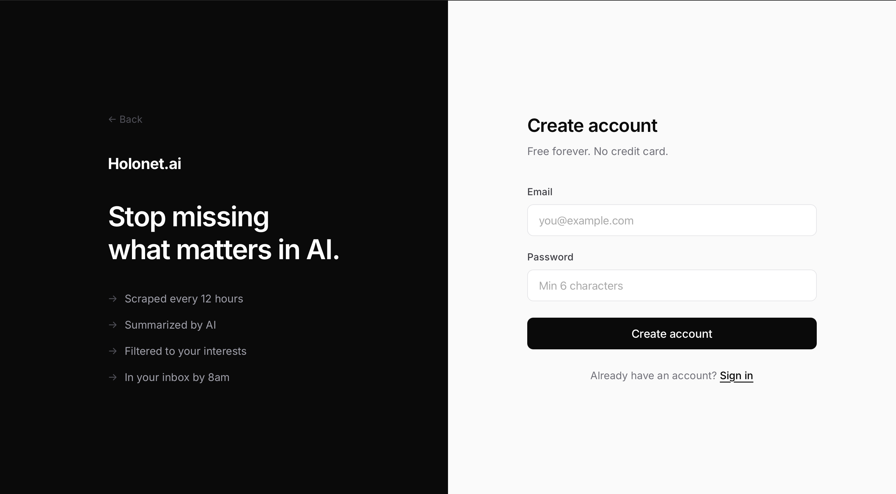
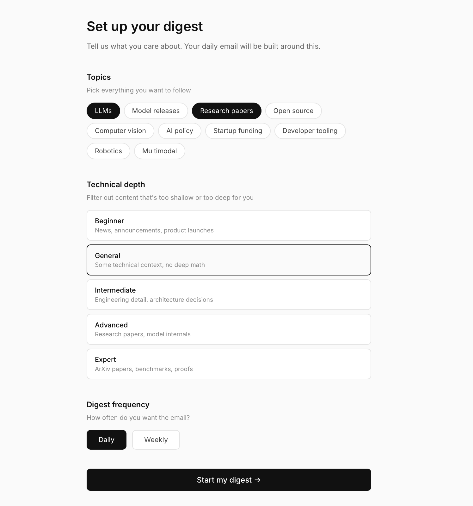
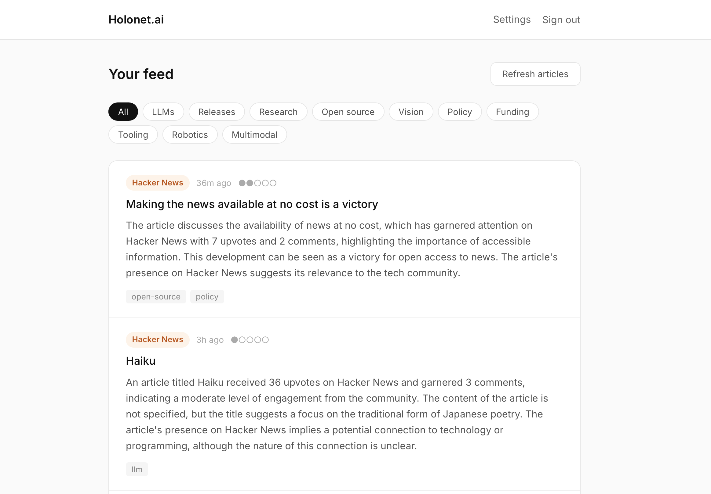
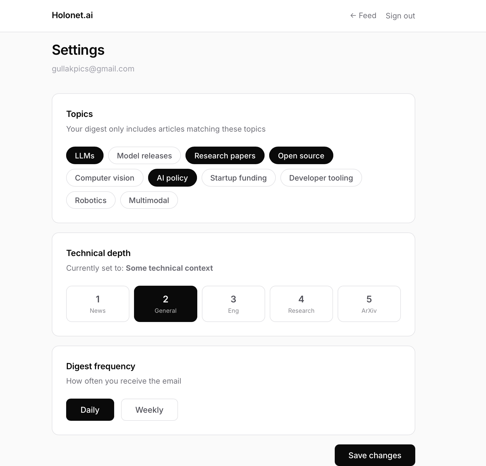

# Holonet.ai

> The pulse of AI, delivered every morning.

**Holonet.ai** is a full-stack AI news aggregator that automatically scrapes, summarizes, and personalizes AI news for you — so you never miss what matters.
Link : https://holonet-ai.vercel.app
---



---

## Features

- **Automated scraping** — HackerNews, ArXiv, and TechCrunch scraped every 12 hours
- **AI summarization** — Every article summarized by Llama 3.3 70B via Groq
- **Personalized feed** — Filter by topic and technical depth
- **Daily email digest** — Top 10 articles in your inbox every morning at 8am
- **Digest archive** — Every past email viewable in the app
- **Zero noise** — Only articles matching your exact interests

---

## Screenshots

### Landing Page


### Sign Up


### Onboarding — Topic Setup


### Live Feed


### Settings


---

## How It Works

```
Every 12 hours
──────────────
HackerNews API  ──┐
ArXiv XML API   ──┼──► Pipeline ──► Groq LLM ──► Postgres ──► Feed
TechCrunch HTML ──┘

Every morning at 8am
─────────────────────
Postgres ──► Personalization ──► React Email ──► Resend ──► Your inbox
```

1. **Scrape** — Three scrapers run in parallel, pulling the latest AI news
2. **Deduplicate** — Articles already in the DB are skipped
3. **Analyze** — Each new article is sent to Llama 3.3 70B which returns a summary, topic tags, and a technical depth score (1–5)
4. **Store** — Enriched articles saved to Postgres, immediately live on the feed
5. **Digest** — Every morning, each user gets a personalized top 10 based on their preferences

---

## Tech Stack

| Layer | Technology |
|---|---|
| Frontend | React + Vite + TypeScript |
| Backend | Node.js + Express + TypeScript |
| Database | Supabase (Postgres) |
| ORM | Prisma |
| Auth | Supabase Auth |
| LLM | Groq — Llama 3.3 70B |
| Email | Resend + React Email |
| Scheduling | node-cron |
| Monorepo | pnpm workspaces |
| Hosting | Render (API) + Vercel (Frontend) |

---

## Project Structure

```
holonet.ai/
├── apps/
│   ├── api/                          # Express backend
│   │   ├── src/
│   │   │   ├── emails/
│   │   │   │   └── DigestEmail.tsx   # React Email template
│   │   │   ├── lib/
│   │   │   │   ├── db.ts             # Prisma client
│   │   │   │   ├── logger.ts         # Pino structured logger
│   │   │   │   ├── scheduler.ts      # Cron job scheduler
│   │   │   │   └── supabase.ts       # Supabase admin client
│   │   │   ├── middleware/
│   │   │   │   ├── auth.middleware.ts
│   │   │   │   └── error.middleware.ts
│   │   │   ├── routes/
│   │   │   │   ├── articles.routes.ts
│   │   │   │   ├── auth.routes.ts
│   │   │   │   ├── digests.routes.ts
│   │   │   │   └── preferences.routes.ts
│   │   │   └── services/
│   │   │       ├── digest.service.ts
│   │   │       ├── llm.service.ts
│   │   │       ├── pipeline.service.ts
│   │   │       └── scrapers/
│   │   │           ├── arxiv.scraper.ts
│   │   │           ├── hackernews.scraper.ts
│   │   │           └── venturebeat.scraper.ts
│   │   └── prisma/
│   │       └── schema.prisma
│   └── web/                          # React frontend
│       └── src/
│           ├── components/
│           │   └── ProtectedRoute.tsx
│           ├── lib/
│           │   ├── api.ts            # Axios + auth interceptor
│           │   └── supabase.ts
│           ├── pages/
│           │   ├── LandingPage.tsx
│           │   ├── loginPage.tsx
│           │   ├── signupPage.tsx
│           │   ├── OnboardingPage.tsx
│           │   ├── FeedPage.tsx
│           │   └── SettingsPage.tsx
│           └── store/
│               └── auth.store.ts     # Zustand auth state
└── packages/
    └── shared/                       # Shared TypeScript types
```

---

## Data Model

```
User
 ├── UserPreferences
 │     topics[]           — e.g. ["llm", "research-paper", "tooling"]
 │     minTechnicalDepth  — 1 (news) to 5 (ArXiv papers)
 │     digestFrequency    — daily | weekly
 └── Digest[]
       └── DigestArticle[] → Article

Article
  title, url, source, summary, tags[], technicalDepth, publishedAt, processedAt
```

---

## Topic Taxonomy

Articles are tagged with one or more of these categories:

| Tag | Description |
|---|---|
| `llm` | Large language models |
| `model-release` | New model announcements |
| `research-paper` | Academic papers |
| `open-source` | Open source projects and releases |
| `computer-vision` | Vision models and applications |
| `policy` | AI regulation and governance |
| `startup-funding` | VC rounds and acquisitions |
| `tooling` | Developer tools and infrastructure |
| `robotics` | Physical AI and robotics |
| `multimodal` | Multi-modal models and systems |

**Technical depth** is scored 1–5:

| Score | Meaning |
|---|---|
| 1 | General news, announcements |
| 2 | Some technical context |
| 3 | Engineering detail, architecture decisions |
| 4 | Research level content |
| 5 | ArXiv papers with math |

---

## API Reference

```
GET  /health                  Health check

GET  /auth/me                 Current user
POST /auth/logout             Invalidate session

GET  /preferences             Get user preferences
PUT  /preferences             Create or update preferences

GET  /articles                Paginated feed
                              ?tags=llm,tooling
                              ?depth=3
                              ?page=2
GET  /articles/:id            Single article

GET  /digests                 Digest archive
GET  /digests/:id             Single digest

POST /pipeline/run            Manually trigger scrape (dev)
POST /digest/send             Manually trigger digest send (dev)
```

---

## Deployment

| Service | Platform |
|---|---|
| Frontend | Vercel |
| Backend | Render |
| Database | Supabase |

Every push to `main` auto-deploys both services.

---

## License

MIT